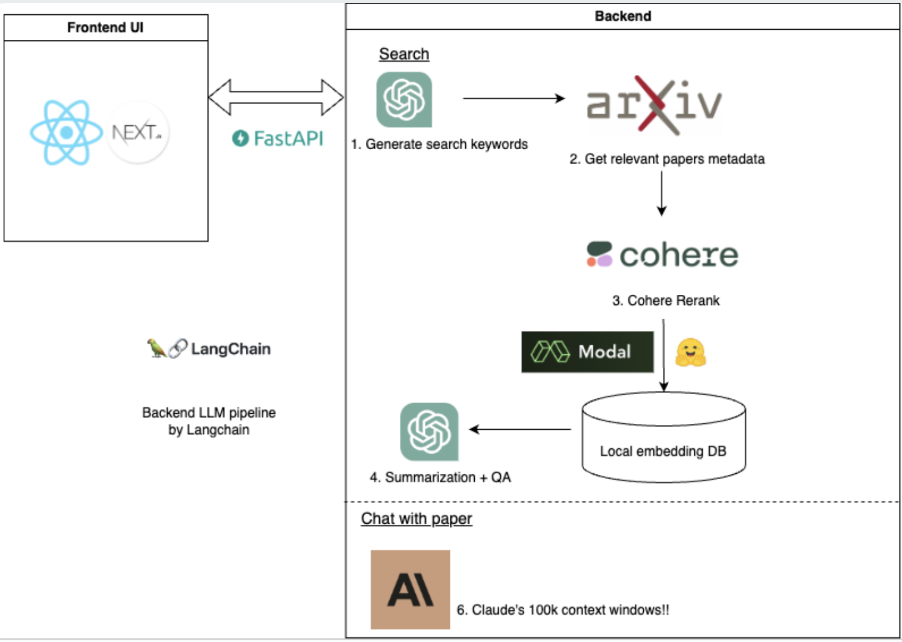

# AI Research Assistant
### *Misery-free literature reviews*
This project was part of the TribeAI Hackathon.  
Team: Kiyo Kunii [@921kiyo](https://github.com/921kiyo), Hector Lopez Hernandez, PhD [@lopez-hector](https://github.com/lopez-hector), and Yifan Yuan [@cosmicthermo](https://github.com/cosmicthermo).

## Motivation

Literature reviews are a critical component of scientific workflows. They are key in staying up-to-date with research progress and for creating the foundation of new research endeavors.  

Logistically, creating a literature review is often plagued by cumbersome tasks that include:
1) sifting a large body of research for relevant articles, 
2) tedious parsing of papers for relevant nuggets of information, 
3) summarization of that information, and
4) synthesis of the information to create a report of the current state of research/technology/field.

## Solution
Large language models provide an exciting opportunity to enhance, accelerate, and likely improve the literature review process. They are excellent models for summarizing, answering questions, and extracting context from text.  

We created a framework that improves the literature experience end-to-end; from a large query of 100s of papers down to a personalized chat with individual papers.  

In short, this repo provides a means of: 

1) querying ArXiv 
2) retrieving a collective answer from K research articles
3) retrieving individual answers from each relevant research article
4) chatting with individual papers

## Technical Architecture
1) NextJS Frontend
2) ChatGPT Keyword Search Generation
3) arXiv API paper retrieval
4) Cohere Rerank to identify top K documents
5) Embedding with [Instructor-XL](https://huggingface.co/hkunlp/instructor-xl)  
   5a. optional embedding with Modal
6) FAISS vectorstore
7) ChatGPT Question and answer
8) Claude-v1.3-100K powered chat with individual papers



# Installation

## How to run Frontend

1. `cd frontend`
2. Run `npm install`
3. Run `npm run dev`

## How to run FastAPI backend

1. `pip install -r requirements.txt`
2. `cd backend/src`
3. `uvicorn server.app:app --reload`
4. Go to `http://127.0.0.1:8000/docs` in your browser and you can make REST call (GET, POST) from the browser.

## Environment variables

```
export MODAL=false
export OPENAI_API_KEY=sk-XXX
export ROOT_DIRECTORY=local-directory
export COHERE_API_KEY=your_key
export ANTHROPIC_API_KEY=your_key
export SERPAPI_API_KEY=your_key
```
